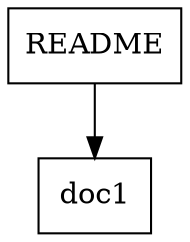
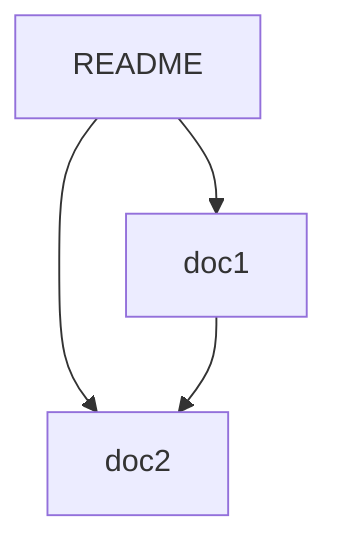

# Obsidian Vault-Style Markdown Bijection

This feature implements a **bidirectional mapping** (bijection) between:
1. **Markdown bracket links** (e.g., `[[filename]]`) — the logical link structure
2. **Repository folder structure** — the physical file organization

This creates an Obsidian-like vault experience for the repository, connecting the conceptual graph of linked documents with the hierarchical tree of folders.

## Concept

### The Bijection

The feature maps between two representations of the same knowledge base:

```
Folder Tree (Physical)  ↔  Link Graph (Logical)
       ├── docs/                 README → doc1
       │   ├── guide.md          README → doc2
       │   └── ref.md            doc1 → doc2
       ├── README.md             guide → README
       ├── doc1.md
       └── doc2.md
```

Both views represent **rooted tree structures**:
- **Folder tree**: Hierarchical containment (parent/child = folder/file)
- **Link graph**: Can be visualized as a tree by clustering connected documents

This connects directly to the repository's core theme: **rooted trees and their algebra**.

## Features

### 1. Link Extraction and Analysis
- Parse `[[bracket]]` style links from markdown files
- Support `[[filename]]` and `[[folder/filename]]` formats
- Handle display text: `[[link|display text]]`
- Build bidirectional link graph (forward links + backlinks)

### 2. Structure Mapping
- Convert folder hierarchy to rooted tree
- Convert link graph to rooted tree via clustering
- Express both as **parentheses notation** (like the rooted tree algorithms)
- Compare structural properties (depth, branching factor, etc.)

### 3. Validation
- Detect broken links (references to non-existent files)
- Find orphaned files (no incoming or outgoing links)
- Validate link consistency

### 4. Suggestions
- **Links from structure**: Suggest bracket links for files in the same folder
- **Structure from links**: Suggest folder reorganization based on link patterns
- Create correspondence between physical and logical organization

### 5. Visualization
- ASCII tree view of folder structure
- ASCII tree view of link graph
- Export to GraphViz DOT, Mermaid, or JSON
- Show link statistics (most connected files, etc.)

## Installation

No installation needed! The tools are pure Python with only standard library dependencies.

```bash
# Make the scripts executable
chmod +x obsidian_vault.py vault_tree_bijection.py

# Or run with python3
python3 obsidian_vault.py
python3 vault_tree_bijection.py
```

## Usage

### Basic Vault Analysis

```bash
# Analyze current directory
python3 obsidian_vault.py

# Analyze specific directory
python3 obsidian_vault.py /path/to/vault

# Show just the folder tree
python3 obsidian_vault.py --tree

# Show just statistics
python3 obsidian_vault.py --stats

# Find broken links
python3 obsidian_vault.py --broken

# Export graph
python3 obsidian_vault.py --export json --output my-vault
```

### Tree-Graph Bijection

```bash
# Show both structures as rooted trees
python3 vault_tree_bijection.py

# Compare structures
python3 vault_tree_bijection.py --compare

# Get link suggestions based on folder structure
python3 vault_tree_bijection.py --suggest-links

# Get folder structure suggestions based on links
python3 vault_tree_bijection.py --suggest-folders
```

## Examples

### Example 1: Analyze Link Structure

```bash
$ python3 obsidian_vault.py --stats

📊 Link Graph Statistics:
Total files: 15
Total links: 42

🔗 Most connected files:
  README: 8 connections (3→ 5←)
  nesting-branching: 6 connections (2→ 4←)
  rooted-trees: 5 connections (4→ 1←)
```

### Example 2: Compare Folder and Link Trees

```bash
$ python3 vault_tree_bijection.py --compare

📊 Structure Comparison:

Folder Tree:
  nodes: 15
  depth: 3
  avg_branching: 4.2
  
Link Graph:
  nodes: 15
  depth: 2
  avg_branching: 5.8

Folder tree (parentheses): ((())()()()()()()()())
Link graph (parentheses): (()()()()()()()()()())
```

The **parentheses notation** directly connects to the rooted tree algorithms in this repository!

### Example 3: Find and Fix Broken Links

```bash
$ python3 obsidian_vault.py --broken

❌ Broken Links:
  doc1.md:
    → [[nonexistent]] (not found)
  guide.md:
    → [[old-file]] (not found)
```

### Example 4: Suggest Links

```bash
$ python3 vault_tree_bijection.py --suggest-links

💡 Suggested Links (based on folder structure):

  In README.md, consider adding:
    [[doc1]]
    [[doc2]]
    [[guide]]

  In doc1.md, consider adding:
    [[doc2]]
    [[README]]
```

## Integration with Rooted Trees

This feature directly connects to the repository's core algorithms:

### 1. Parentheses Notation
Both folder trees and link graphs use the same **parentheses notation** as the rooted tree enumeration algorithms:

```python
# From vault_tree_bijection.py
tree.to_parentheses()  # Returns "(()()())" etc.

# Compare with list-rooted-trees-optimized.py
# Both use the same canonical representation!
```

### 2. Tree Structure
The bijection creates **rooted trees** from both views:
- Root = vault/repository root
- Nodes = files or folders
- Edges = containment (folders) or links (graph)

### 3. Algebraic Operations
The two structures embody the **nesting** and **branching** algebra:
- **Nesting**: Folder hierarchy (A contains B)
- **Branching**: Link patterns (A links to B and C)

## API Reference

### MarkdownVault Class

```python
from obsidian_vault import MarkdownVault

vault = MarkdownVault("/path/to/vault")
vault.scan()

# Get broken links
broken = vault.get_broken_links()

# Get orphaned files
orphaned = vault.get_orphaned_files()

# Build structures
tree = vault.build_tree_structure()
graph = vault.build_link_graph()

# Export
vault.export_graph("output.json", format="json")
```

### VaultTreeBijection Class

```python
from vault_tree_bijection import VaultTreeBijection

bijection = VaultTreeBijection(vault)

# Convert structures
folder_tree = bijection.folder_structure_to_tree()
link_tree = bijection.link_graph_to_tree()

# Compare
comparison = bijection.compare_structures()

# Get suggestions
link_suggestions = bijection.suggest_links_from_structure()
folder_suggestions = bijection.suggest_structure_from_links()
```

### TreeNode Class

```python
from vault_tree_bijection import TreeNode

# Build tree
root = TreeNode("vault")
child = TreeNode("file1", is_file=True)
root.add_child(child)

# Convert to parentheses notation
notation = root.to_parentheses()  # "(())"
```

## File Format

### Markdown Links

The tool recognizes several bracket link formats:

```markdown
# Basic link
See [[filename]] for details.

# Link with display text
See [[filename|nice display name]] for details.

# Path-based link
See [[folder/subfolder/filename]] for details.

# Multiple links
Check [[doc1]], [[doc2]], and [[doc3]].
```

### Export Formats

**JSON** (for programmatic use):
```json
{
  "nodes": {
    "README": {
      "path": "README.md",
      "outgoing": 3,
      "incoming": 5
    }
  },
  "edges": [
    {
      "from": "README",
      "to": "doc1",
      "valid": true
    }
  ]
}
```

**GraphViz DOT** (for visualization):


**Mermaid** (for GitHub/documentation):


## Testing

Run the comprehensive test suite:

```bash
python3 test_vault.py
```

Tests cover:
- Link extraction from markdown
- Broken link detection
- Orphaned file detection
- Tree construction
- Parentheses notation generation
- Bijection mappings
- Structure comparison

## Use Cases

### 1. Documentation Management
- Ensure all documentation files are properly linked
- Find orphaned documentation
- Organize docs into logical clusters

### 2. Knowledge Base Organization
- Map conceptual relationships (links) to physical structure (folders)
- Identify tightly-coupled document clusters
- Suggest reorganization for better navigation

### 3. Content Validation
- CI/CD integration to check for broken links
- Ensure consistent cross-referencing
- Validate documentation completeness

### 4. Vault Migration
- Import from/export to Obsidian
- Convert between different note-taking systems
- Maintain link integrity during reorganization

### 5. Research and Analysis
- Study document interconnection patterns
- Analyze information architecture
- Visualize knowledge structures

## Connection to OEIS A000081

The parentheses notation used for trees directly relates to **OEIS A000081** (unlabeled rooted trees):

```python
# A vault with this structure:
vault/
  ├── README.md
  ├── doc1.md
  └── docs/
      └── guide.md

# Becomes the rooted tree (in parentheses):
"((())()())"

# Which corresponds to a 4-tree in OEIS A000081!
```

This creates a beautiful connection:
- **Repository structure** = rooted tree
- **Link structure** = rooted tree  
- **Bijection** = mapping between two tree representations

## Advanced Features

### Custom Clustering

The link graph clustering uses a simple heuristic (link neighborhoods), but can be extended:

```python
# Custom clustering based on topic keywords
def cluster_by_topics(vault):
    # Extract keywords from content
    # Group files by similar keywords
    # Create suggested folder structure
    pass
```

### Link Graph Metrics

```python
# Calculate graph metrics
def analyze_centrality(vault):
    # PageRank-style importance
    # Betweenness centrality
    # Community detection
    pass
```

### Automatic Link Insertion

```python
# Automatically add suggested links
def auto_link(vault, suggestions):
    for file_key, targets in suggestions.items():
        # Insert [[target]] links into file
        pass
```

## Future Enhancements

Potential additions:
- [ ] Web-based graph visualization
- [ ] Interactive exploration interface
- [ ] Git integration (track link changes over time)
- [ ] Semantic link types (references, elaborates, contradicts, etc.)
- [ ] Integration with `list-rooted-trees-optimized.py` for counting valid structures
- [ ] Bidirectional sync with Obsidian vaults
- [ ] Link validation in CI/CD pipelines
- [ ] Automatic table of contents generation

## Contributing

Contributions welcome! Areas of interest:
- Additional export formats
- Better clustering algorithms
- Visualization improvements
- Integration with other note-taking systems
- Performance optimizations

## References

### Obsidian
- [Obsidian.md](https://obsidian.md/) - The inspiration for bracket links
- [Obsidian Documentation](https://help.obsidian.md/)

### Rooted Trees
- [OEIS A000081](https://oeis.org/A000081) - Unlabeled rooted trees
- [Rosetta Code: List Rooted Trees](http://rosettacode.org/wiki/List_rooted_trees)

### Graph Theory
- [Graph-based Knowledge Management](https://en.wikipedia.org/wiki/Graph_database)
- [Network Analysis](https://en.wikipedia.org/wiki/Network_theory)

## License

Same license as the main repository. See [LICENSE](LICENSE) for details.

---

**Bijection**: Creating harmony between physical structure and logical connections, mirroring the fundamental algebra of rooted trees.
